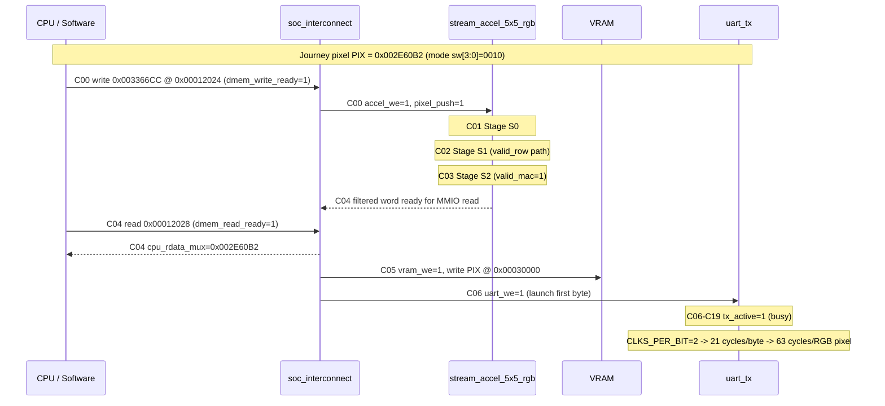

# 20-Cycle Timing Diagram (Pipelined RGB Stream + UART)

Source table: `docs/timing_table_20_cycles_rgb_uart_stream.txt`

## Mermaid View

## Cycle Waveform (C00 to C19)

Legend: `1` asserted/high, `.` deasserted/low, labels show stage transitions.

| Signal | C00 C01 C02 C03 C04 C05 C06 C07 C08 C09 C10 C11 C12 C13 C14 C15 C16 C17 C18 C19 |
|---|---|
| token stage | PUSH S0 S1 S2 READ VRAM UARTR BUSY BUSY BUSY BUSY BUSY BUSY BUSY BUSY BUSY BUSY BUSY BUSY BUSY |
| accel_we | 1 . . . . . . . . . . . . . . . . . . . |
| pixel_push | 1 . . . . . . . . . . . . . . . . . . . |
| valid_mul | 1 . . . . . . . . . . . . . . . . . . . |
| valid_row | . 1 . . . . . . . . . . . . . . . . . . |
| valid_mac | . . . 1 . . . . . . . . . . . . . . . . |
| final_pixel_reg=PIX | . . . . 1 1 1 1 1 1 1 1 1 1 1 1 1 1 1 1 |
| dmem_write_ready | 1 . . . . 1 1 . . . . . . . . . . . . . |
| dmem_read_ready | . . . . 1 . . 1 1 1 1 1 1 1 1 1 1 1 1 1 |
| vram_we | . . . . . 1 . . . . . . . . . . . . . . |
| uart_we | . . . . . . 1 . . . . . . . . . . . . . |
| tx_active | . . . . . . 1 1 1 1 1 1 1 1 1 1 1 1 1 1 |

## Timing Summary

- `push -> valid_mac = 3 cycles`
- `push -> CPU-visible filtered word = 4 cycles`
- `push -> VRAM write = 5 cycles`
- `push -> UART launch = 6 cycles`
- UART is the throughput bottleneck in steady state (`63 cycles/pixel` minimum in this testbench configuration).
